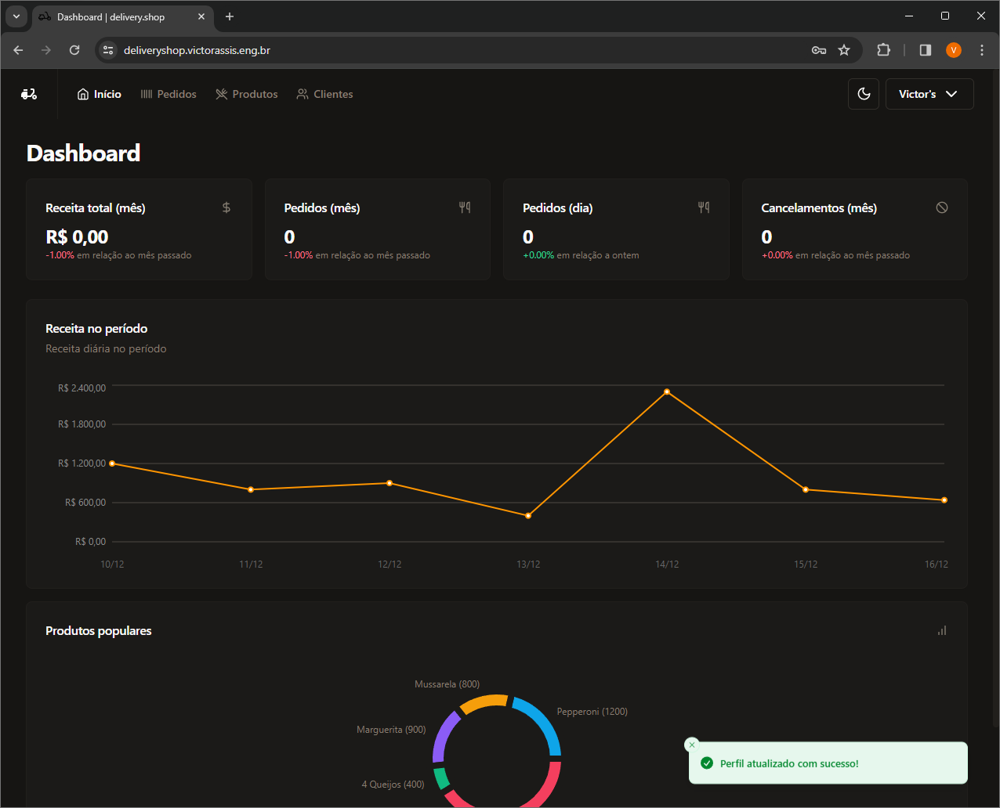
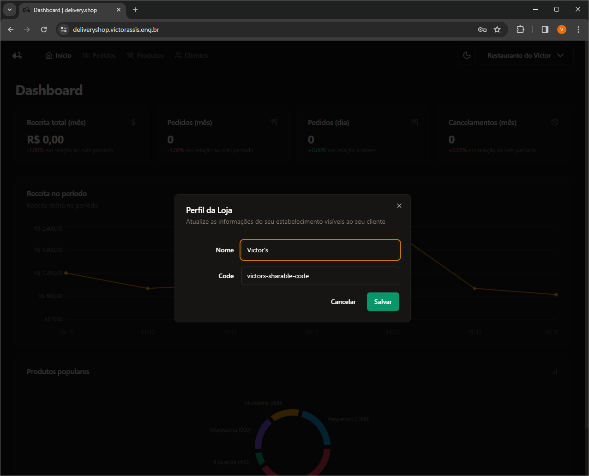
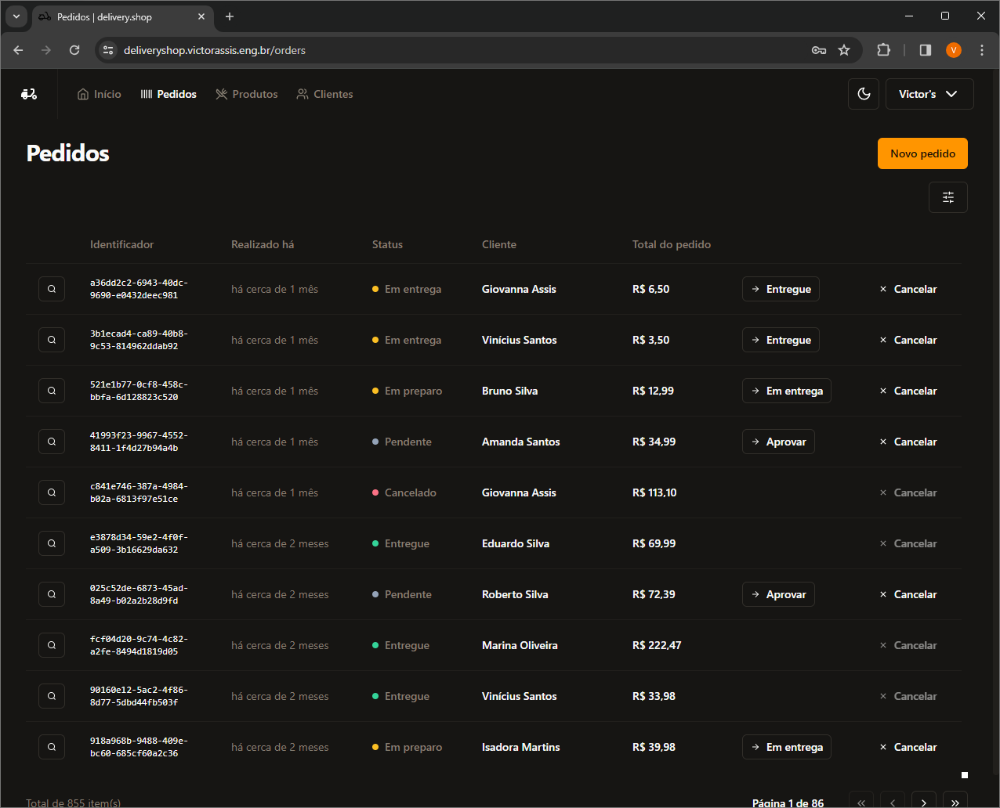
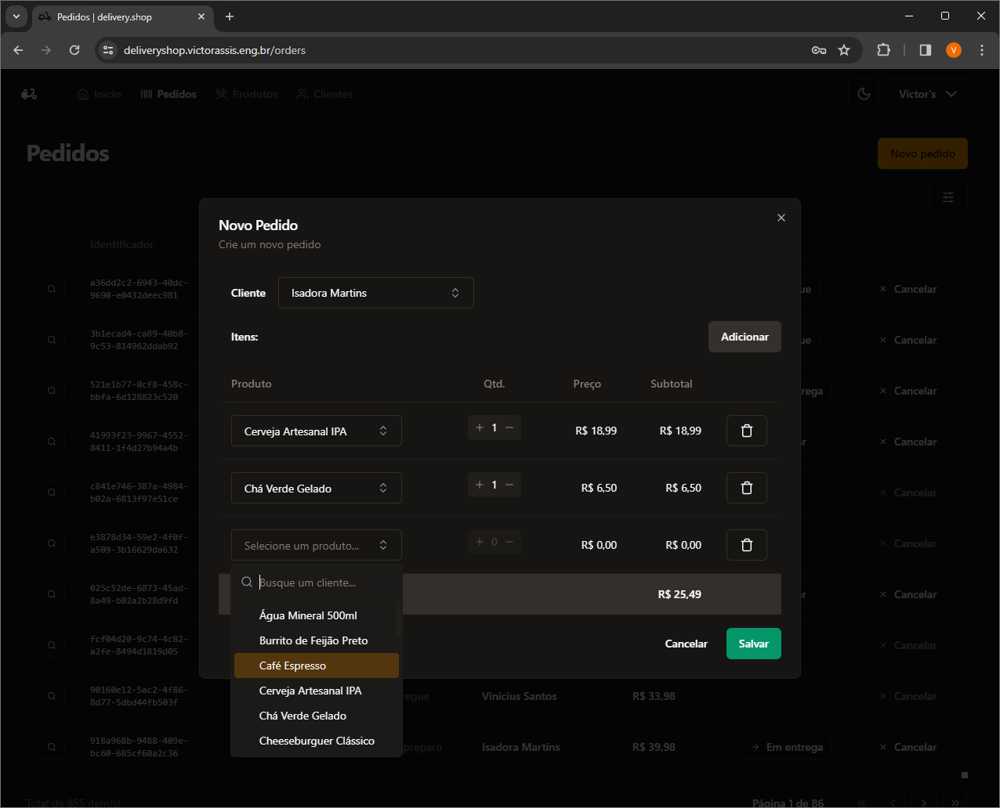
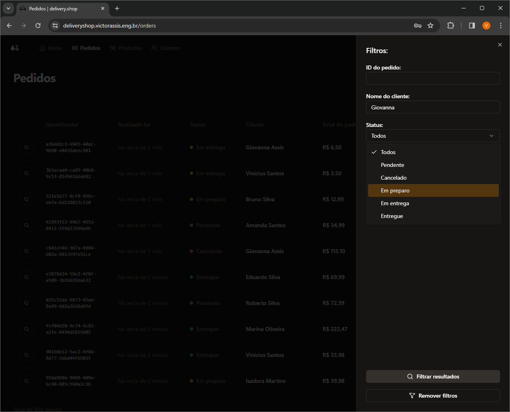
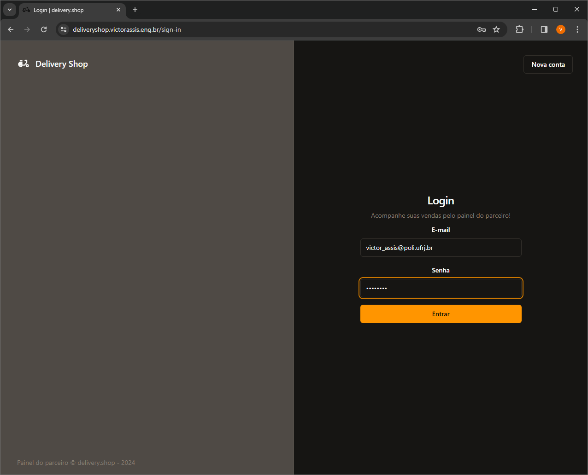
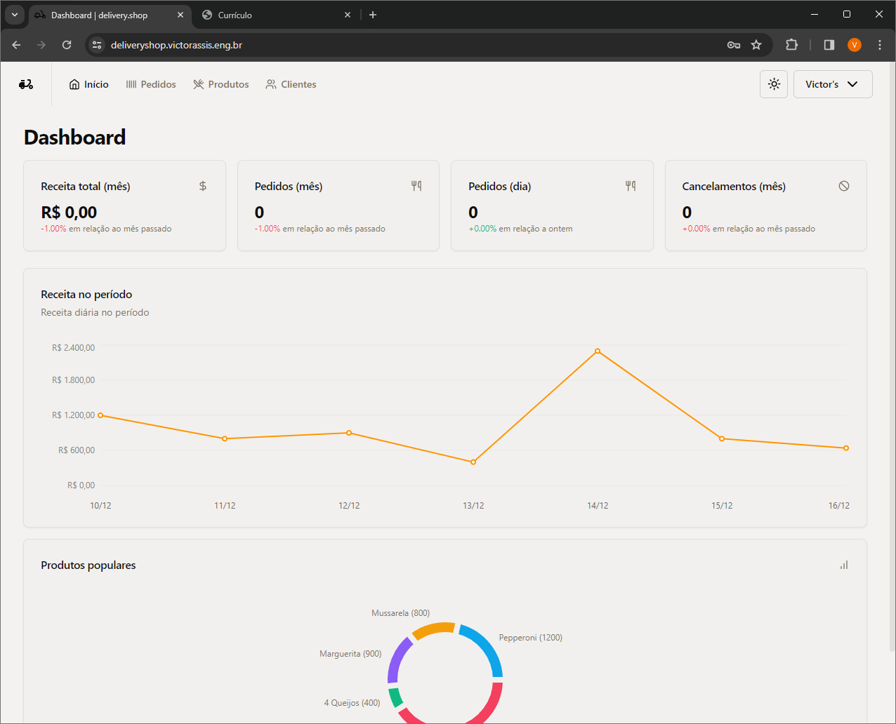
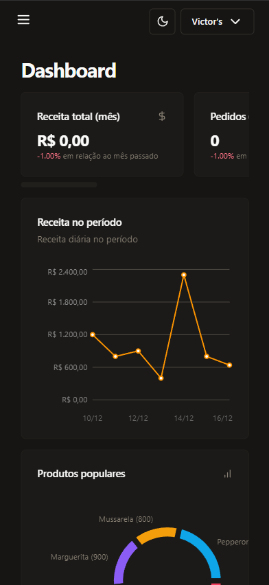
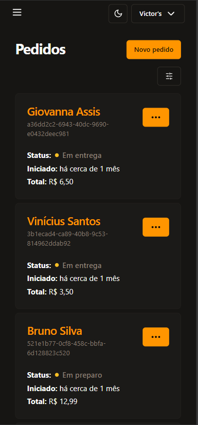

# Delivery Shop (Frontend)

Welcome to Delivery Shop, the frontend portion of a web system designed to streamline the management of delivery restaurants. This application provides a comprehensive set of features for handling orders, customers, and products, along with tracking relevant statistics to optimize restaurant operations.

## Project Availability

The Delivery Shop application can be accessed via the following link:

🔗 [React Delivery Shop](https://deliveryshop.victorassis.eng.br)

⚠ Please note that as the project is hosted on a free tier plan, there might be a substantial delay in retrieving the initial response for the first request. However, subsequent requests should function normally.

## Features

* Orders management (create, update status, view details)
* Customer management (create, update, delete)
* Product management (create, update, delete)
* Dashboard with operational insights
* Light and dark themes
* Toast notifications
* User authentication and authorization
* Workspace management

## Tools and Technologies (Frontend)

* Vite
* Typescript
* React
* React Router DOM
* React Hook Form
* TanStack React Query
* Shadcn/ui
* Tailwind CSS
* ESlint and Prettier
* Axios
* WebSockets

## Prints
### Dashboard

### Update store Dialog

### Order Table

### New Order Dialog

### Order Table Filter

### Login

### Dashboard - Light Theme

### Dashboard - Mobile

### Order Card List
